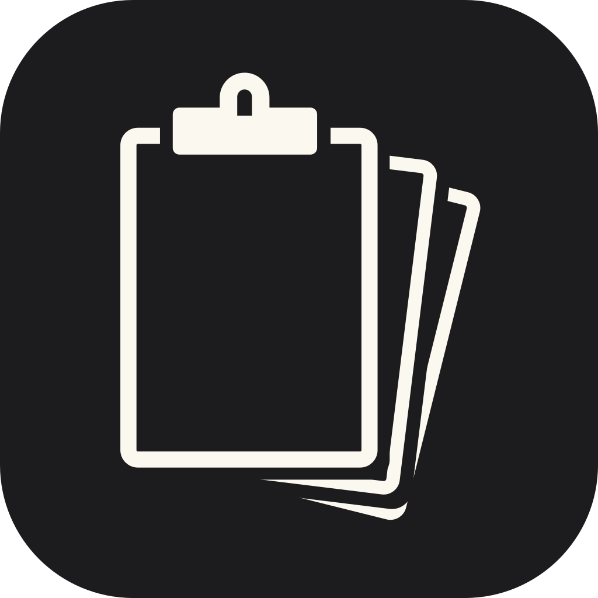

# Clipdeck

A lightweight, cross-platform clipboard manager.
It captures what you copy, lets you browse and re-use it later, and stays out of your way otherwise.

No subscription, no monetization, no app store.
The website is at [baala3.github.io/clipdeck](https://baala3.github.io/clipdeck/); its source lives in [site/](site/).
See [docs/INSTALL.md](docs/INSTALL.md) to download and run it, and [CONTEXT.md](CONTEXT.md) for the project's glossary and domain language.

Design decisions are recorded as ADRs in [docs/adr/](docs/adr/).

Clipdeck is released under the [MIT License](LICENSE).
